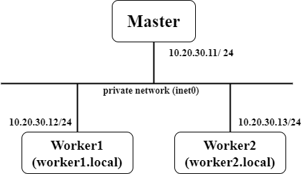

# Ansible environment on Vagrant

## Network Architecture



- Master: Nodes to execute ansible.
- Worker: Nodes configured by ansible.

## Run Ansible (ansible-master)
```shell
vagrant@master:~/share$ ansible-inventory  --graph --vers
ansible-inventory [core 2.14.2]
  config file = /home/vagrant/share/ansible.cfg
  configured module search path = ['/home/vagrant/.ansible/plugins/modules', '/usr/share/ansible/plugins/modules']
  ansible python module location = /usr/lib/python3/dist-packages/ansible
  ansible collection location = /home/vagrant/.ansible/collections:/usr/share/ansible/collections
  executable location = /usr/bin/ansible-inventory
  python version = 3.10.4 (main, Apr  2 2022, 09:04:19) [GCC 11.2.0] (/usr/bin/python3)
  jinja version = 3.0.3
  libyaml = True
```


```shell
vagrant@master:~/share$ ansible all -i hosts.yml --list-hosts
  hosts (2):
    worker1
    worker2
```


```shell
vagrant@master:~/share$ ansible all -i hosts.yml -m command -a uptime
worker1 | CHANGED | rc=0 >>
 09:31:46 up 7 min,  1 user,  load average: 0.00, 0.05, 0.05
worker2 | CHANGED | rc=0 >>
 09:31:46 up 6 min,  1 user,  load average: 0.00, 0.06, 0.04
 ```
